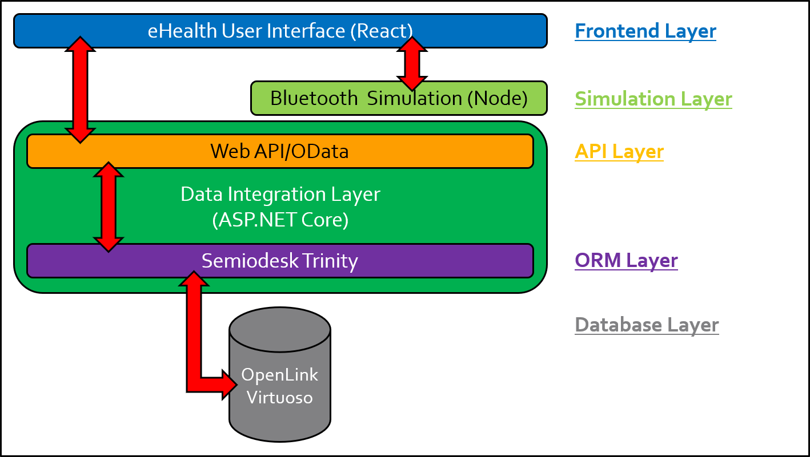
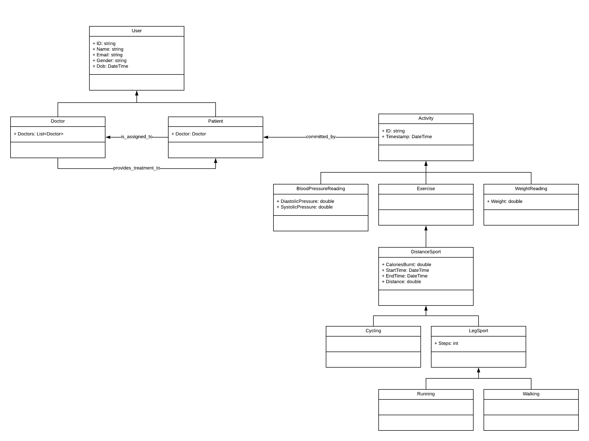

# eHealth Mobile Application
The eHealth Mobile Application is a digital healthcare management platform for patients and doctors. It will be commissioned with the intent of accelerating the demand for an openly-accessible healthcare platform in the age of digitalisation.

Healthcare professionals can use it in order to track the health conditions of their patients. Patients can use it like a fitness tracking application where they can record their personal health data via Bluetooth synchronisation or manual user input. Recordable activities include blood pressure reading, weight reading as well as physical exercise that encompass walking, running, and cycling.

This application is currently in development but a pre-release evaluation version can be cloned from this repository for deployment purposes. In order to deploy the eHealth application, please refer to the deployment steps detailed in the "eHealth-Mobile", "eHealth-DIL", and the "eHealth-BluetoothSimulation" directories.

## Technology Stack
|   eHealth Component    | Technology               | Purpose                               |
|:----------------------:|:------------------------:|:-------------------------------------:|
| Mobile App             | React Ionic (JavaScript) | Application for Mobile Devices        |
| Data Integration Layer | ASP.NET Core 2.2 (C#)    | Server for Data Model Management      |
| Bluetooth Simulation   | Express (JavaScript)     | Simulation for Bluetooth Connectivity |
| Semiodesk Trinity      | C#                       | ORM Library for Semantic Databases    |
| OData                  | C#                       | API Library for Open Data Access      |
| OpenLink Virtuoso      |                          | Semantic Database                     |

## System Architecture

## Business Ontology

## Data Protection Declaration
The pre-release evaluation version of this application is only meant evaluation purposes. Therefore any data that has been collected through the mobile application will be stored on a locally-hosted Virtuoso instance outside the internet. Should the Data Integration Layer be disconnected, any data stored in Virtuoso will be subject to immediate deletion.

Once this application has reached its release version that will be publically accessible to everyone, GDPR will be enforced that will be guaranteeing the data security and protection of our users without breaching their privacy.

The misuse of this platform is not tolerated as any recorded data contains sensible information. The evaluation of the eHealth application can only be consented on a unilateral basis from the project owner's side. Should you intend to reuse this application for own purposes that includes the possibility of hosting it online, please do consult with us in order to negotiate the terms of third-party usage. Third-party users will be liable to implementing GDPR for their own purposes.
